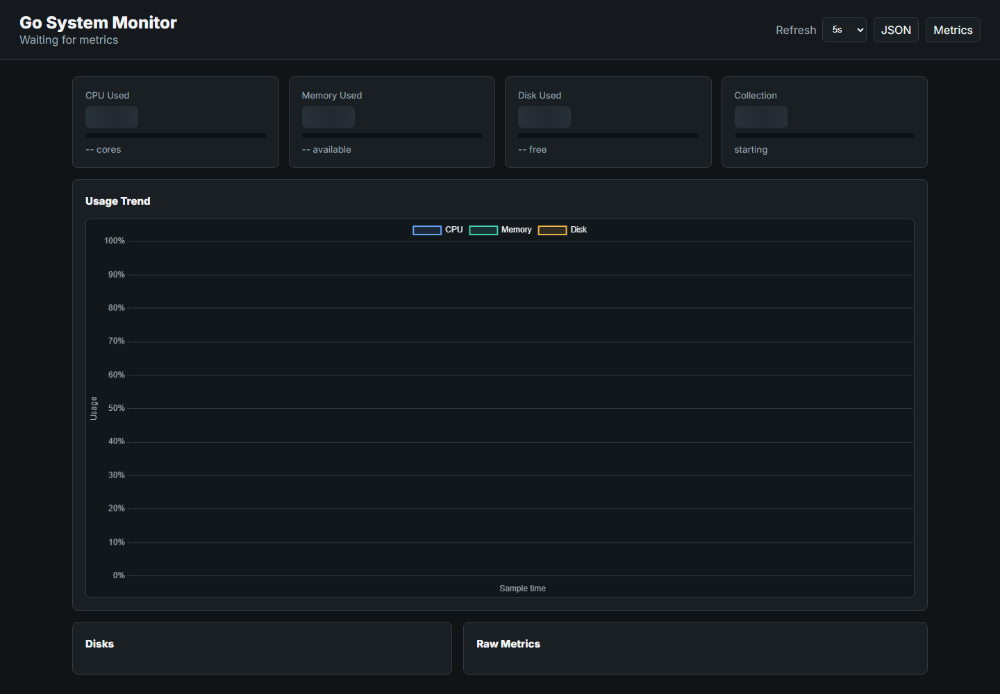

# Go System Monitor

A cross-platform system monitoring app written in Go. It collects CPU, memory,
and disk metrics concurrently, exposes Prometheus-compatible output, provides a
JSON API, and serves a real-time browser dashboard from the same single binary.

## Features

- Concurrent metric collection with goroutines and channels.
- Prometheus `/metrics` endpoint for observability pipelines.
- JSON `/api/stats` endpoint for custom integrations.
- Embedded dashboard UI with live refresh and usage trends.
- Linux CPU counters from `/proc/stat`.
- Windows CPU, memory, page file, and disk metrics through native Windows APIs.
- Linux and Windows disk gauges for size, free, available, and used ratio.
- Network receive/transmit byte counters.
- System uptime metric.
- Static Linux binary and Windows `.exe` build scripts.
- Docker Compose stack for Go System Monitor, Prometheus, and Grafana.
- One-shot output by default, with optional watch mode.

## Dashboard Preview



## Requirements

- Go 1.25 or newer.
- Linux, Windows, or WSL.
- Linux provides CPU mode counters from `/proc/stat`.
- Windows provides logical CPU cores, physical memory, page file, and disk
  metrics through native Windows APIs.

## CLI

```bash
go run ./cmd/gosysmon
```

On Windows PowerShell:

```powershell
go run .\cmd\gosysmon
```

Collect disk metrics for multiple mount points:

```bash
go run ./cmd/gosysmon --path / --path /var
```

On Windows, pass drive paths:

```powershell
go run .\cmd\gosysmon --path C:\ --path W:\
```

Refresh continuously:

```bash
go run ./cmd/gosysmon --watch --interval 10s
```

## Dashboard

Start the web app:

```bash
go run ./cmd/gosysmon --serve --addr :9090
```

On Windows:

```powershell
go run .\cmd\gosysmon --serve --addr :9090 --path W:\
```

Open:

```text
http://localhost:9090
```

Useful endpoints:

```text
GET /              Browser dashboard
GET /api/stats     JSON metrics
GET /metrics       Prometheus text format
GET /healthz       Health check
```

Example output:

```text
# HELP gosysmon_cpu_seconds_total Seconds the CPUs spent in each mode since boot.
# TYPE gosysmon_cpu_seconds_total counter
gosysmon_cpu_seconds_total{mode="user"} 1234.56
# HELP gosysmon_memory_available_bytes Estimated physical memory available for new workloads in bytes.
# TYPE gosysmon_memory_available_bytes gauge
gosysmon_memory_available_bytes 6733971456
```

## Build

Build a statically linked Linux binary:

```bash
CGO_ENABLED=0 GOOS=linux GOARCH=amd64 go build -trimpath -ldflags="-s -w" -o bin/gosysmon ./cmd/gosysmon
```

On Windows PowerShell:

```powershell
$env:CGO_ENABLED='0'; $env:GOOS='linux'; $env:GOARCH='amd64'
go build -trimpath -ldflags="-s -w" -o bin/gosysmon ./cmd/gosysmon
```

Build a Windows executable:

```powershell
.\scripts\build-windows.ps1
```

Build a Docker image:

```bash
docker build -t gosysmon .
docker run --rm -p 9090:9090 gosysmon
```

Run the full Prometheus and Grafana stack:

```bash
docker compose up --build
```

Then open:

```text
Go System Monitor: http://localhost:9090
Prometheus:        http://localhost:9091
Grafana:           http://localhost:3000
```

Grafana login defaults to `admin` / `admin`.

## Verify

```bash
go test ./...
go vet ./...
```

## Resume Bullet

Built a cross-platform Go system monitor with concurrent metric collection,
Prometheus-compatible `/metrics`, JSON API, embedded real-time dashboard,
network and uptime metrics, Docker Compose Prometheus/Grafana stack, release
automation, and GitHub Actions CI for Windows and Linux.
